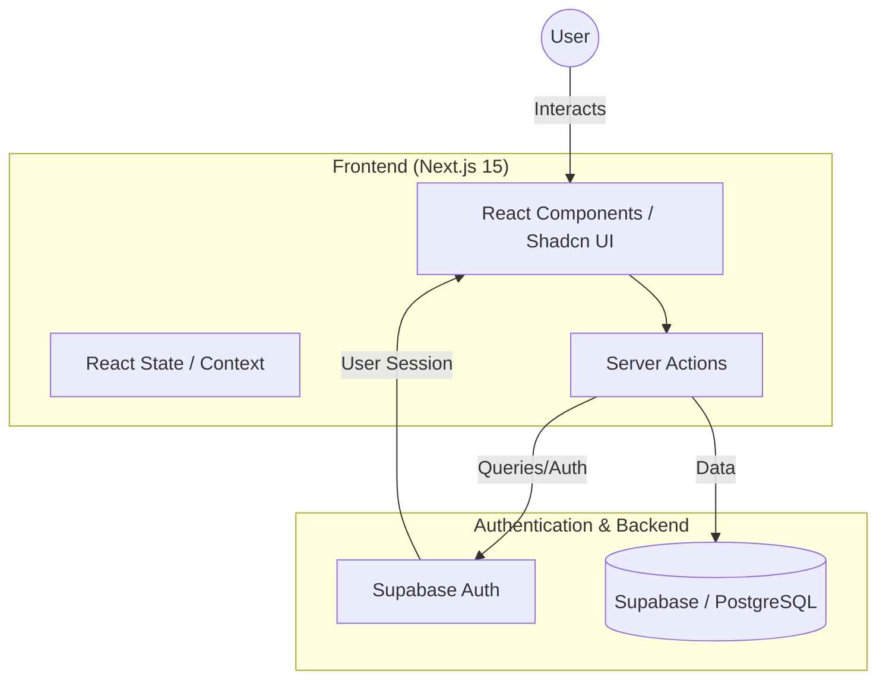

# PlatformStream 🚀

**PlatformStream** is a professional, production-ready blogging network built for creators. It features a modern tech stack, responsive design, and robust authentication.


## 🏗️ Architecture Overview



## ✨ Features

- **Auth**: Secure authentication via Supabase (Email/Password & OTP).
- **8-Digit Verification**: Enhanced security with 8-digit OTP codes for registration.
- **Blogging**: Create, edit, and manage professional blog posts.
- **Conversations**: Interactive comment system with real-time feedback.
- **Personalized Dashboard**: Manage your content and explore the global feed.
- **Dark Mode**: Sleek dark mode support out of the box.
- **Responsive Branding**: Custom-branded interface using the PlatformStream logo.

## 🛠️ Tech Stack

- **Framework**: [Next.js 15](https://nextjs.org/) (App Router)
- **Styling**: [Tailwind CSS](https://tailwindcss.com/)
- **UI Components**: [Shadcn UI](https://ui.shadcn.com/)
- **Database / Auth**: [Supabase](https://supabase.com/)
- **Icons**: [Lucide React](https://lucide.dev/)
- **State Management**: React Hooks & Supabase Auth State

## 🚀 Getting Started

### Prerequisites

- Node.js 18+ 
- A Supabase Project

### Installation

1. **Clone the repository:**
   ```bash
   git clone https://github.com/RahulRaja-14/blog-platform.git
   cd blog-platform
   ```

2. **Install dependencies:**
   ```bash
   npm install
   ```

3. **Environment Setup:**
   Create a `.env.local` file in the root directory and add your Supabase credentials:
   ```env
   NEXT_PUBLIC_SUPABASE_URL=your-project-url
   NEXT_PUBLIC_SUPABASE_ANON_KEY=your-anon-key
   ```

4. **Run the development server:**
   ```bash
   npm run dev
   ```
   Open [http://localhost:3000](http://localhost:3000) to view the result.

## ⚙️ Configuration Notes

### 8-Digit OTP Support
To ensure the 8-digit OTP works correctly, you must update your Supabase Auth settings:
1. Go to **Authentication > Providers > Email**.
2. Change **OTP length** from `6` to `8`.
3. Update **Email Templates** to include `{{ .Token }}`.

## 📂 Project Structure

- `src/app`: Next.js App Router (Pages & Layouts)
- `src/components`: Reusable UI components
- `src/utils/supabase`: Supabase cliente/server configuration
- `src/lib`: Utility functions and shared types
- `public/`: Static assets (Logo, etc.)

## 📄 License

This project is private and intended for the PlatformStream network.
